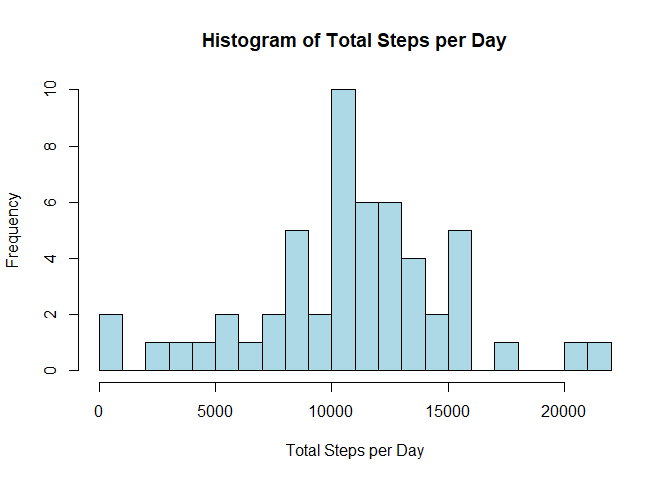
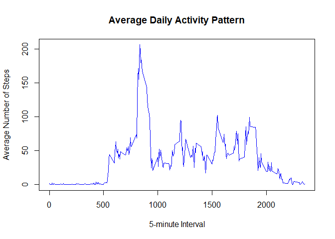
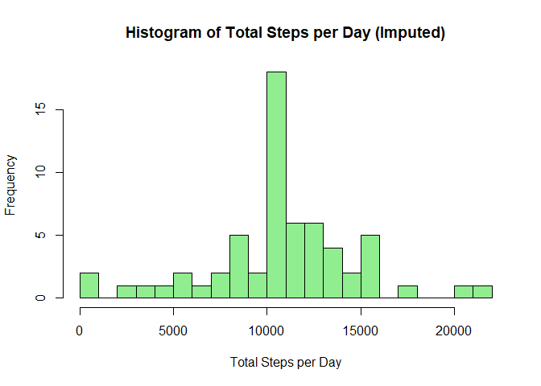
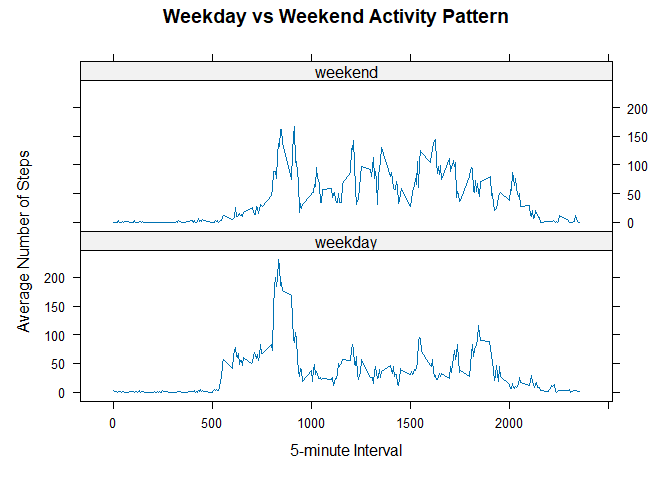

## Loading and Preprocessing the Data


``` r
#Load dataset
data <- read.csv("activity.csv")

# Convert date to Date format
data$date <- as.Date(data$date)
```

---

## What is mean total number of steps taken per day?

### 1. Calculate the total number of steps taken per day


``` r
daily_steps <- aggregate(steps ~ date, data, sum, na.rm=TRUE)
head(daily_steps)
```

```
##         date steps
## 1 2012-10-02   126
## 2 2012-10-03 11352
## 3 2012-10-04 12116
## 4 2012-10-05 13294
## 5 2012-10-06 15420
## 6 2012-10-07 11015
```

### 2. Histogram of total steps per day


``` r
hist(daily_steps$steps,
     main="Histogram of Total Steps per Day",
     xlab="Total Steps per Day",
     col="lightblue",
     breaks=20)
```

<!-- -->

### 3. Mean and Median of total steps per day


``` r
mean_steps <- mean(daily_steps$steps)
median_steps <- median(daily_steps$steps)

mean_steps
```

```
## [1] 10766.19
```

``` r
median_steps
```

```
## [1] 10765
```

---

## What is the average daily activity pattern?

### 1. Time series plot of average number of steps per interval


``` r
interval_avg <- aggregate(steps ~ interval, data, mean, na.rm=TRUE)

plot(interval_avg$interval,
     interval_avg$steps,
     type="l",
     col="blue",
     main="Average Daily Activity Pattern",
     xlab="5-minute Interval",
     ylab="Average Number of Steps")
```

<!-- -->

### 2. 5-minute interval with maximum average steps


``` r
max_interval <- interval_avg[which.max(interval_avg$steps), ]
max_interval
```

```
##     interval    steps
## 104      835 206.1698
```

---

## Imputing Missing Values

### 1. Total number of missing values


``` r
total_missing <- sum(is.na(data$steps))
total_missing
```

```
## [1] 2304
```

### 2. Strategy for filling missing values

We replace missing step values with the **mean for that 5-minute interval**.


``` r
# Calculate mean per interval
interval_means <- aggregate(steps ~ interval, data, mean, na.rm=TRUE)

# Create a copy of dataset
data_imputed <- data

# Replace NA values
for(i in 1:nrow(data_imputed)){
  if(is.na(data_imputed$steps[i])){
    interval_value <- data_imputed$interval[i]
    data_imputed$steps[i] <- interval_means$steps[
      interval_means$interval == interval_value]
  }
}
```

---

### 3. Histogram after imputing missing values


``` r
daily_steps_imputed <- aggregate(steps ~ date, data_imputed, sum)

hist(daily_steps_imputed$steps,
     main="Histogram of Total Steps per Day (Imputed)",
     xlab="Total Steps per Day",
     col="lightgreen",
     breaks=20)
```

<!-- -->

### 4. Mean and Median after imputation


``` r
mean_imputed <- mean(daily_steps_imputed$steps)
median_imputed <- median(daily_steps_imputed$steps)

mean_imputed
```

```
## [1] 10766.19
```

``` r
median_imputed
```

```
## [1] 10766.19
```

---

## Are there differences in activity patterns between weekdays and weekends?

### 1. Create weekday/weekend factor variable


``` r
data_imputed$day_type <- ifelse(
  weekdays(data_imputed$date) %in% c("Saturday", "Sunday"),
  "weekend",
  "weekday"
)

data_imputed$day_type <- as.factor(data_imputed$day_type)
```

### 2. Panel plot comparing weekday vs weekend patterns


``` r
library(lattice)

avg_by_day <- aggregate(steps ~ interval + day_type,
                        data_imputed,
                        mean)

xyplot(steps ~ interval | day_type,
       data=avg_by_day,
       type="l",
       layout=c(1,2),
       xlab="5-minute Interval",
       ylab="Average Number of Steps",
       main="Weekday vs Weekend Activity Pattern")
```

<!-- -->

---
